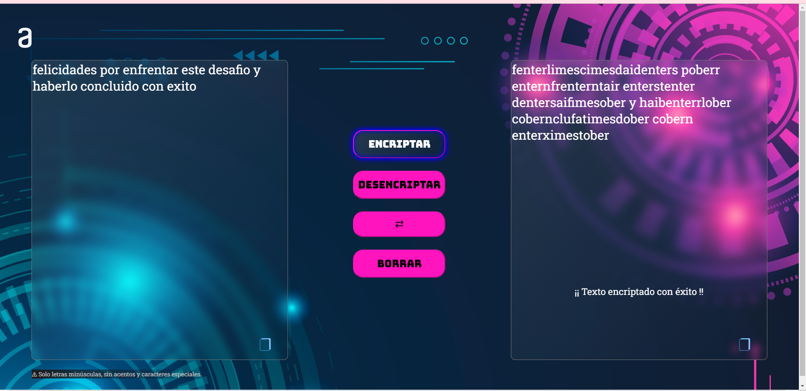
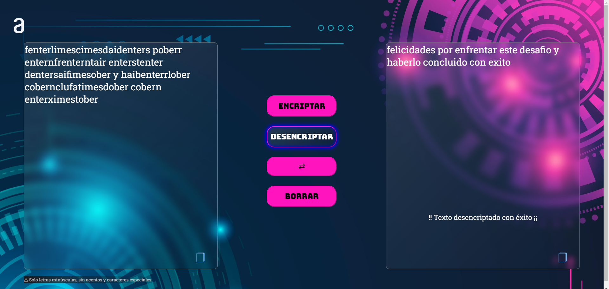
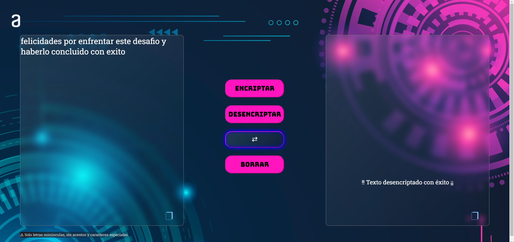
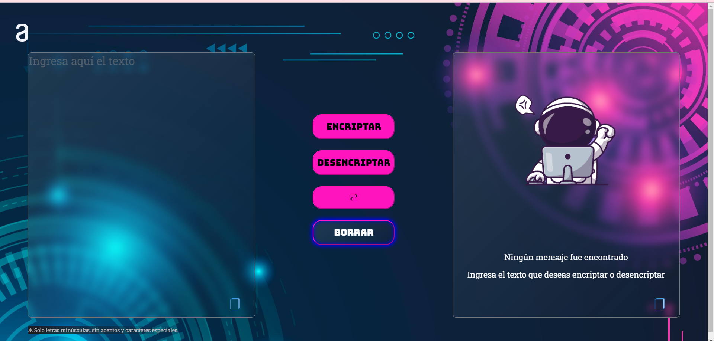
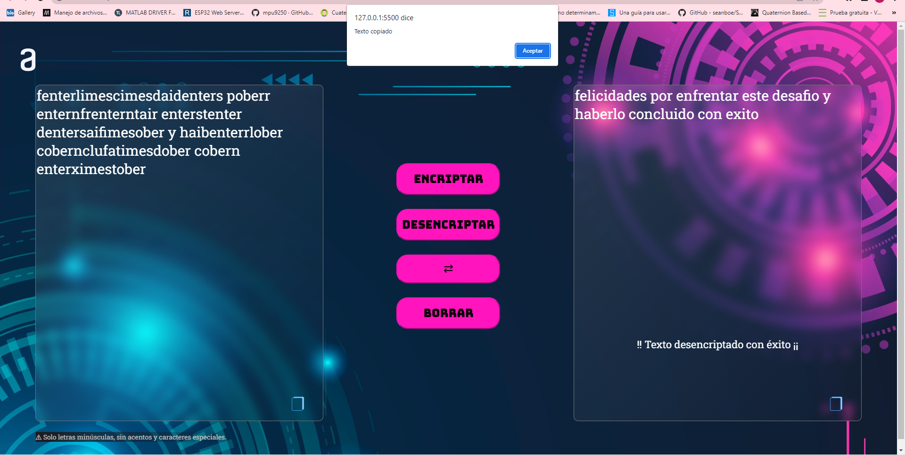
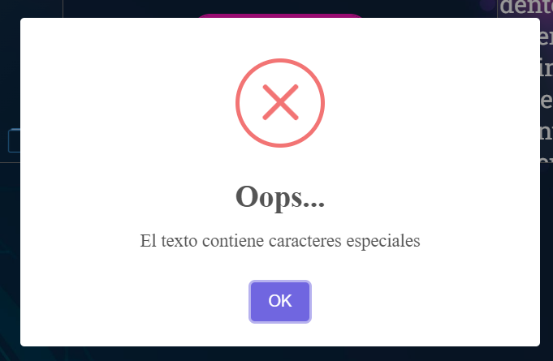

<h1 align="center"># Encriptador de texto</h1>

[Pagina](image/Pantalla.png)

## Descripción

 ¡Bienvenido a la página de Encriptación de Texto! Esta aplicación fácil de usar ofrece una experiencia fluida para encriptar y desencriptar texto a través de una interfaz sencilla. Con su diseño intuitivo, puedes encriptar fácilmente tu texto, ver la salida encriptada, desencriptar texto, copiar texto entre ventanas y restaurar la interfaz a su estado original.

## Interface Preview

## Funciones

 1. Encriptar Texto: Comienza ingresando el texto que deseas encriptar en el campo de entrada. Ten en cuenta que el texto de entrada no debe contener acentos ni caracteres especiales. Nuestro esquema de encriptación utiliza las siguientes “claves” de conversión:
    - La letra “e” se convierte en “enter”
    - La letra “i” se convierte en “imes”
    - La letra “a” se convierte en “ai”
    - La letra “o” se convierte en “ober”
    - La letra “u” se convierte en “ufat”
  
 2. Encriptar y Mostrar: Una vez que hayas ingresado el texto deseado, simplemente haz clic en el botón “Encriptar” para iniciar el proceso de encriptación. La aplicación convertirá el texto de entrada utilizando nuestro esquema de encriptación y mostrará el texto encriptado en la ventana de resultados.

 3. Desencriptar Texto: Para recuperar el texto original de un mensaje encriptado, haz clic en el botón “Desencriptar”. Esta acción desencriptará el texto presente en la ventana de entrada y revelará el mensaje original en la ventana de salida.

 4. Pasar Texto: Transfiere fácilmente el texto encriptado desde la ventana de salida de vuelta al campo de entrada haciendo clic en el botón “Pasar Texto”. Esta función te permite modificar o encriptar el texto existente de manera conveniente, sin tener que volver a escribirlo.

 5. Borrar: ¿Necesitas comenzar de nuevo? Simplemente haz clic en el botón “Limpiar” para borrar el contenido del campo de entrada y restaurar la interfaz a su estado inicial. Esta opción proporciona una forma rápida y sin complicaciones de comenzar una nueva sesión de encriptación o desencriptación.

 6. Icono de Copiar Texto: En cada ventana de texto, encontrarás un icono de copiar ubicado en la esquina inferior derecha. Esta práctica función te permite copiar el texto de cualquier ventana con solo un clic, lo que te permite pegarlo fácilmente en otras aplicaciones o documentos.

## Desarrollador

Este proyecto es desarrollado por:

- Alma Aide Sánchez Ramírez

## Instalacion
Para utilizar la interfaz de cifrado de texto, siga estos pasos: 

1. Clona el repositorio:

    Abre el archivo index.html en el navegador web de tu preferencia.

## Uso

1. Introduce el texto que deseas encriptar en el campo de entrada. Asegúrate de que el texto de entrada no contenga acentos ni caracteres especiales.

2. Haz clic en el botón “Encriptar” para iniciar el proceso de encriptación. El texto encriptado se mostrará en la ventana de salida.
 
<h1 align="center"></h1>

3. Para desencriptar el texto y recuperar el mensaje original, haz clic en el botón “Desencriptar”.
 
<h1 align="center"></h1>

4. Si necesitas copiar el texto desde la ventana de salida de vuelta al campo de entrada, simplemente haz clic en el botón “Pasar Texto”.
 
<h1 align="center"></h1>

5. Para restablecer la interfaz y borrar el contenido del campo de entrada, haz clic en el botón “Borrar”.
 
<h1 align="center"></h1>

6. Si prefieres utilizar el botón de copiar texto, al hacer clic en él aparecerá una alerta de confirmación indicando que el texto ha sido copiado. Además, todo el texto se seleccionará automáticamente para tu comodidad.
 
<h1 align="center"></h1>

**Nota**: En caso de que el texto introducido contenga caracteres especiales, se mostrará una ventana de alerta notificando la presencia de dichos caracteres. De igual manera, si intentas encriptar un texto vacío, las ventanas de alerta te informarán que la operación es inválida.
 
<h1 align="center"></h1>

## Agradecimientos

Me gustaria agradecer a la comunidad de Alura-Oracle por los cursos impartidos para poder generar este proyecto.
